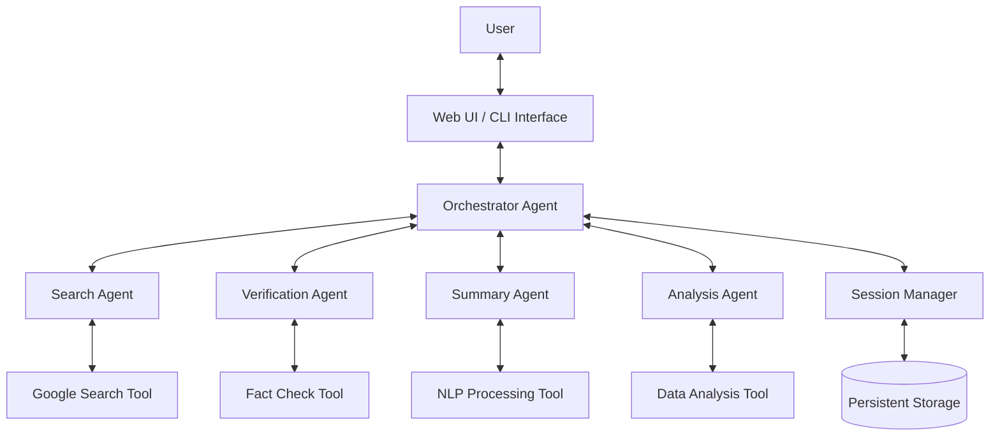

# Design Document: Smart Research Assistant

## Overview

The Smart Research Assistant is an advanced AI-powered application built on the Agent Development Kit (ADK) that helps users conduct comprehensive research by leveraging multiple specialized agents and tools. The system integrates web search capabilities, information extraction, fact verification, content summarization, and session management to provide a seamless research experience.

This design document outlines the architecture, components, interfaces, data models, error handling, and testing strategy for implementing the Smart Research Assistant.

## Architecture

The Smart Research Assistant follows a multi-agent architecture with a central orchestrator agent that coordinates specialized sub-agents. This design allows for modularity, extensibility, and separation of concerns while enabling complex workflows.

### High-Level Architecture



### Key Architectural Components

1. **Orchestrator Agent**: The central agent that manages the overall research workflow, delegates tasks to specialized agents, and maintains conversation context.

2. **Specialized Agents**:
   - **Search Agent**: Handles information gathering from various sources
   - **Verification Agent**: Validates information accuracy and source credibility
   - **Summary Agent**: Processes and condenses information into digestible formats
   - **Analysis Agent**: Performs specialized analysis on research data

3. **Tools**:
   - **Google Search Tool**: Integrated ADK tool for web searches
   - **Fact Check Tool**: Custom tool for cross-referencing information
   - **NLP Processing Tool**: For text summarization and organization
   - **Data Analysis Tool**: For statistical analysis and visualization

4. **Session Manager**: Handles persistence of research sessions and user data

5. **Storage Layer**: Provides persistent storage for session data and research artifacts

## Components and Interfaces

### Orchestrator Agent

The Orchestrator Agent serves as the entry point for user interactions and coordinates the workflow between specialized agents.

**Responsibilities**:
- Parse and understand user research queries
- Determine which specialized agent(s) to invoke
- Maintain conversation context and research session state
- Synthesize responses from multiple agents into coherent outputs
- Manage the overall research workflow

**Interface**:
```python
class OrchestratorAgent:
    def __init__(self, model: str, session_manager: SessionManager):
        # Initialize the agent with model and session manager
        
    def process_query(self, query: str, session_id: str) -> dict:
        # Process user query and return response
        
    def create_session(self) -> str:
        # Create a new research session and return session ID
        
    def load_session(self, session_id: str) -> bool:
        # Load an existing research session
        
    def save_session(self, session_id: str) -> bool:
        # Save the current research session
```

### Search Agent

The Search Agent handles information gathering from various sources using the Google Search tool.

**Responsibilities**:
- Execute web searches based on user queries
- Extract relevant information from search results
- Filter and prioritize sources based on relevance and credibility
- Handle pagination and result limitations

**Interface**:
```python
class SearchAgent:
    def __init__(self, model: str):
        # Initialize the agent with model
        
    def search(self, query: str, num_results: int = 5) -> dict:
        # Perform search and return structured results
        
    def focused_search(self, query: str, filters: dict) -> dict:
        # Perform a more targeted search with specific filters
```

### Verification Agent

The Verification Agent validates information accuracy and source credibility.

**Responsibilities**:
- Cross-reference information across multiple sources
- Evaluate source credibility
- Identify conflicting information
- Provide confidence scores for verified information

**Interface**:
```python
class VerificationAgent:
    def __init__(self, model: str):
        # Initialize the agent with model
        
    def verify_fact(self, fact: str, sources: list) -> dict:
        # Verify a specific fact against provided sources
        
    def check_source_credibility(self, source_url: str) -> dict:
        # Evaluate the credibility of a given source
        
    def compare_information(self, statements: list) -> dict:
        # Compare multiple statements for consistency
```

### Summary Agent

The Summary Agent processes and condenses information into digestible formats.

**Responsibilities**:
- Generate concise summaries of research findings
- Organize information by themes or categories
- Format output according to user preferences
- Maintain attribution in summarized content

**Interface**:
```python
class SummaryAgent:
    def __init__(self, model: str):
        # Initialize the agent with model
        
    def summarize(self, content: str, max_length: int = 500) -> dict:
        # Generate a summary of the provided content
        
    def categorize(self, content: str) -> dict:
        # Organize content into categories or themes
        
    def format_output(self, content: dict, format_type: str) -> dict:
        # Format content according to specified format
```

### Analysis Agent

The Analysis Agent performs specialized analysis on research data.

**Responsibilities**:
- Conduct statistical analysis on numerical data
- Generate visualizations of data
- Extract entities and relationships from text
- Translate content between languages

**Interface**:
```python
class AnalysisAgent:
    def __init__(self, model: str):
        # Initialize the agent with model
        
    def analyze_data(self, data: list, analysis_type: str) -> dict:
        # Perform statistical analysis on data
        
    def generate_visualization(self, data: list, chart_type: str) -> dict:
        # Create visualization based on data
        
    def extract_entities(self, text: str) -> dict:
        # Extract named entities from text
        
    def translate(self, text: str, target_language: str) -> dict:
        # Translate text to target language
```

### Session Manager

The Session Manager handles persistence of research sessions and user data.

**Responsibilities**:
- Create, load, and save research sessions
- Maintain session context and history
- Export research findings in various formats
- Manage multiple research sessions

**Interface**:
```python
class SessionManager:
    def __init__(self, storage_provider):
        # Initialize with storage provider
        
    def create_session(self) -> str:
        # Create a new session and return session ID
        
    def load_session(self, session_id: str) -> dict:
        # Load session data by ID
        
    def save_session(self, session_id: str, data: dict) -> bool:
        # Save session data
        
    def export_session(self, session_id: str, format: str) -> bytes:
        # Export session data in specified format
        
    def list_sessions(self) -> list:
        # List all available sessions
```

## Data Models

### Research Session

```python
class ResearchSession:
    session_id: str  # Unique identifier for the session
    created_at: datetime  # Creation timestamp
    updated_at: datetime  # Last update timestamp
    topic: str  # Main research topic
    queries: List[ResearchQuery]  # List of queries in this session
    findings: List[ResearchFinding]  # List of research findings
    notes: List[UserNote]  # User-added notes
```

### Research Query

```python
class ResearchQuery:
    query_id: str  # Unique identifier for the query
    timestamp: datetime  # When the query was made
    text: str  # The query text
    agent: str  # Which agent processed this query
    results: List[QueryResult]  # Results for this query
```

### Query Result

```python
class QueryResult:
    result_id: str  # Unique identifier for the result
    source: str  # Source of the information
    content: str  # The actual content
    confidence: float  # Confidence score (0-1)
    verified: bool  # Whether this result has been verified
    metadata: dict  # Additional metadata about the result
```

### Research Finding

```python
class ResearchFinding:
    finding_id: str  # Unique identifier for the finding
    timestamp: datetime  # When the finding was created
    title: str  # Short title for the finding
    content: str  # The finding content
    sources: List[str]  # Sources supporting this finding
    categories: List[str]  # Categories/tags for this finding
```

### User Note

```python
class UserNote:
    note_id: str  # Unique identifier for the note
    timestamp: datetime  # When the note was created
    content: str  # The note content
    related_findings: List[str]  # Related finding IDs
```

## Error Handling

The Smart Research Assistant implements a comprehensive error handling strategy to ensure robustness and provide meaningful feedback to users.

### Error Categories

1. **User Input Errors**
   - Invalid queries
   - Unsupported requests
   - Missing parameters

2. **Tool Execution Errors**
   - Search API failures
   - Rate limiting issues
   - Network connectivity problems

3. **Processing Errors**
   - Failed summarization
   - Verification failures
   - Analysis errors

4. **Session Management Errors**
   - Session not found
   - Session corruption
   - Storage access issues

### Error Handling Approach

1. **Graceful Degradation**
   - If a specialized agent fails, the orchestrator will attempt to provide partial results
   - If a tool is unavailable, alternative methods will be used when possible

2. **Informative Error Messages**
   - Clear error messages that explain what went wrong
   - Suggestions for how to resolve the issue
   - Alternative actions when appropriate

3. **Logging and Monitoring**
   - Comprehensive logging of errors for debugging
   - Monitoring of error rates to identify systemic issues
   - User feedback collection on error occurrences

4. **Recovery Mechanisms**
   - Automatic retry for transient errors
   - Session state preservation during errors
   - Rollback capabilities for failed operations

## Testing Strategy

The Smart Research Assistant will be tested using a multi-layered approach to ensure functionality, reliability, and performance.

### Unit Testing

- Test individual components in isolation
- Mock dependencies to focus on component behavior
- Cover edge cases and error conditions
- Ensure high code coverage for core functionality

### Integration Testing

- Test interactions between components
- Verify correct data flow between agents
- Test tool integrations with mock external services
- Validate session management and persistence

### End-to-End Testing

- Simulate complete user research workflows
- Test with realistic research queries
- Verify correct orchestration of multiple agents
- Validate persistence across sessions

### Performance Testing

- Measure response times for various query types
- Test system under load with multiple concurrent users
- Identify bottlenecks in processing pipelines
- Optimize resource usage for common operations

### User Acceptance Testing

- Test with real users performing research tasks
- Collect feedback on usability and effectiveness
- Identify gaps in functionality or user experience
- Validate that the system meets user requirements

## Security Considerations

1. **Data Privacy**
   - User research data will be encrypted at rest and in transit
   - Session data will be isolated between users
   - Personal information will be minimized and protected

2. **Authentication and Authorization**
   - Secure authentication for accessing research sessions
   - Role-based access control for shared research
   - Session expiration and renewal mechanisms

3. **API Security**
   - Rate limiting to prevent abuse
   - Input validation to prevent injection attacks
   - API key rotation and management

4. **Compliance**
   - Adherence to relevant data protection regulations
   - Transparency about data usage and retention
   - User control over their research data