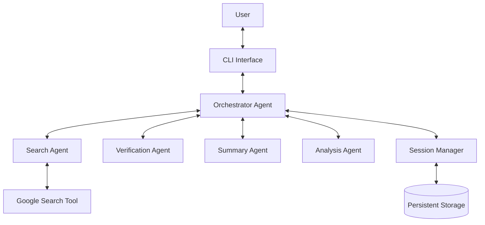

# Smart Research Assistant

The Smart Research Assistant is an advanced AI-powered application built on the Agent Development Kit (ADK) that helps users conduct comprehensive research by leveraging multiple specialized agents and tools. The system integrates web search capabilities, information extraction, fact verification, content summarization, and session management to provide a seamless research experience.

## Features

- **Multi-Agent Architecture**: A central orchestrator agent coordinates specialized agents for search, verification, summarization, and analysis.
- **Session Management**: Persistent research sessions allow you to pick up your work where you left off.
- **Interactive CLI**: An easy-to-use command-line interface for interacting with the assistant.
- **Extensible**: The modular design makes it easy to add new specialized agents and tools.

## Getting Started

### Prerequisites

- Python 3.9+
- An `.env` file with your API keys. See `.env.example` for the required variables.

### Installation

1.  Clone the repository:
    ```bash
    git clone https://github.com/your-repo/smart-research-assistant.git
    cd smart-research-assistant
    ```
2.  Install the dependencies:
    ```bash
    pip install -r requirements.txt
    ```
3.  Create a `.env` file and add your API keys.

### Running the Assistant

To start the interactive CLI, run the following command:

```bash
python main.py
```

## Architecture

The Smart Research Assistant follows a multi-agent architecture with a central orchestrator agent that coordinates specialized sub-agents.



## Usage Examples

### Starting a new session

When you first run the assistant, you will be prompted to start a new session.

```
Enter a topic for your new research session: AI in healthcare
```

### Asking a research question

Once you are in a session, you can ask research questions.

```
What would you like to research? What are the latest applications of AI in drug discovery?
```

The assistant will use the specialized agents to gather, verify, and summarize the information for you.

### Exiting the assistant

To exit the assistant, type `exit`. Your session will be saved automatically.

## Advanced Usage

The Smart Research Assistant can handle a variety of complex queries by leveraging its specialized agents. Here are some examples of the types of queries you can use:

### Verification Queries

To verify a fact, include keywords like "verify" or "fact-check".

```
What would you like to research? Verify that the capital of Australia is Canberra.
```

### Summarization Queries

To get a summary of a topic, use keywords like "summarize" or "give me a summary".

```
What would you like to research? Summarize the main points of the Paris Agreement on climate change.
```

### Comparison Queries

To compare and contrast two or more things, use keywords like "compare", "vs", or "difference".

```
What would you like to research? Compare the features of Python and JavaScript for web development.
```

### Analysis Queries

To perform data analysis, use the keyword "analyze".

```
What would you like to research? Analyze the trend of renewable energy production over the last decade.
```

### Translation Queries

To translate text, use the keyword "translate".

```
What would youlike to research? Translate "hello world" to Spanish.
```

### Entity Extraction Queries

To extract entities from a text, use the phrase "extract entities".

```
What would you like to research? Extract entities from the following text: "Apple Inc. is a technology company headquartered in Cupertino, California."
```

### Version Comparison Queries

To compare two versions of a text, use the format `compare versions: [text1] vs [text2]`.

```
What would you like to research? compare versions: The first version of the text. vs The second version of the text, which is different.
```