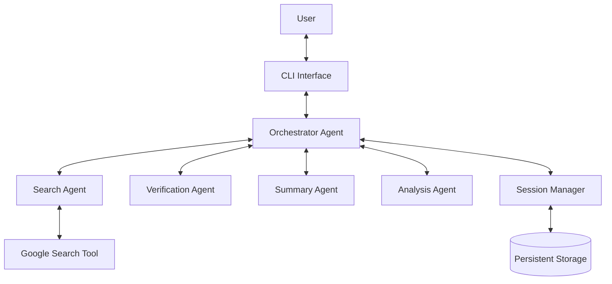
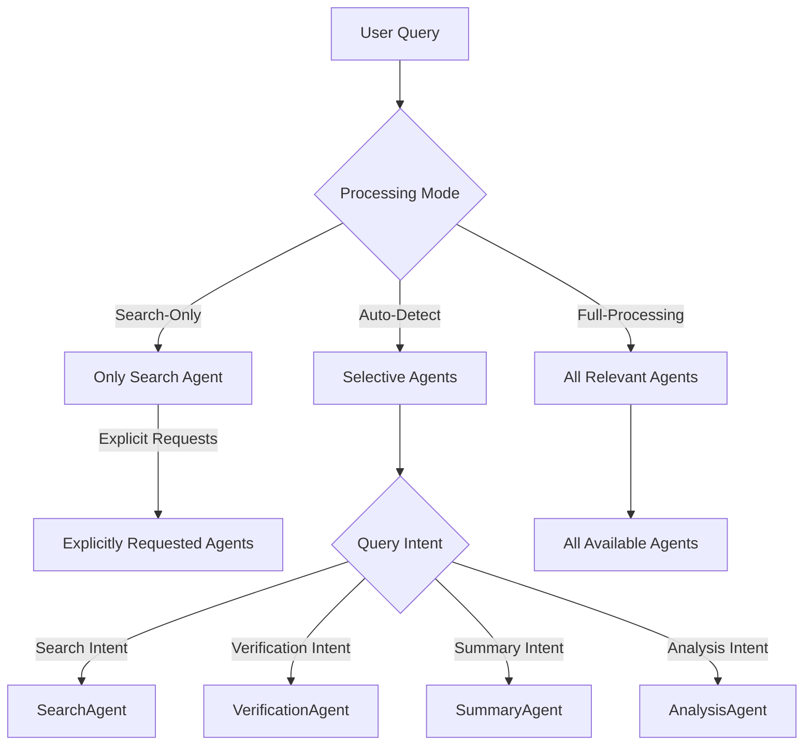

# System Patterns

## High-Level Architecture

The Smart Research Assistant is built on a multi-agent architecture, orchestrated by a central agent. This design pattern allows for a clear separation of concerns, with each specialized agent responsible for a specific task in the research workflow.

## Key Components

- **Orchestrator Agent**: The central coordinator that receives user queries, delegates tasks to the appropriate specialized agents, and aggregates the results.
- **Specialized Agents**:
    - **Search Agent**: Responsible for executing web searches.
    - **Verification Agent**: Responsible for fact-checking claims.
    - **Summary Agent**: Responsible for summarizing text.
    - **Analysis Agent**: Responsible for more in-depth analysis of information.
- **Session Manager**: Manages the lifecycle of research sessions, including creating, loading, and saving session data.
- **Storage Provider**: An abstraction for persistent storage, allowing for different storage backends to be used. The initial implementation uses file-based storage.
- **CLI Interface**: The primary user interface for interacting with the assistant.

## Processing Modes

The system implements three different processing modes that determine which agents are invoked for a given query:

- **Search-Only Mode (Default)**: Only invokes the search agent unless other agents are explicitly requested in the query. This mode is optimized for efficiency and quick results.
- **Auto-Detect Mode**: Uses enhanced query analysis with stricter criteria to determine which agents to invoke based on detected intent.
- **Full-Processing Mode**: Invokes all available and relevant agents for comprehensive processing of each query.

## Data Flow

1. The user initiates a query through the CLI.
2. The `main_cli` function in `main.py` captures the query and passes it to the `SmartResearchAssistant` instance.
3. The `SmartResearchAssistant` delegates the query to the `OrchestratorAgent`.
4. The `OrchestratorAgent` determines the appropriate specialized agent(s) to handle the query based on its content and the current processing mode.
5. The specialized agent(s) perform their tasks (e.g., searching the web, summarizing text).
6. The results are returned to the `OrchestratorAgent`, which synthesizes them into a final response.
7. The response is displayed to the user in the CLI.
8. Session data is updated and saved by the `SessionManager`. 